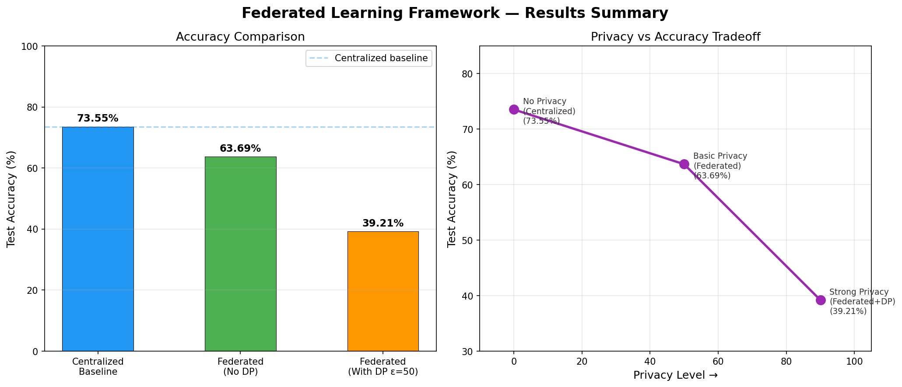

# Federated Learning Framework with Differential Privacy

A production-inspired simulation of Federated Learning across 10 virtual clients, 
built from scratch using PyTorch and Flower. Includes Differential Privacy via Opacus 
to provide mathematical privacy guarantees for client data.

---

## Results

| Method | Test Accuracy | Data Privacy |
|--------|--------------|--------------|
| Centralized Baseline | 73.55% | ❌ Raw data exposed |
| Federated Learning (IID) | 63.69% | ✅ No raw data shared |
| Federated + Differential Privacy (ε=50) | 39.21% | ✅✅ Mathematically guaranteed |

---

## Key Features

- **FedAvg from scratch** — Custom weight aggregation without relying on library defaults
- **10 simulated clients** — Each trains locally on private data partitions
- **Non-IID & IID data splits** — Realistic data distribution across clients
- **Differential Privacy** — Gradient clipping + Gaussian noise via Opacus
- **Privacy-Utility tradeoff analysis** — Visualized across all three training modes

---

## Project Structure
